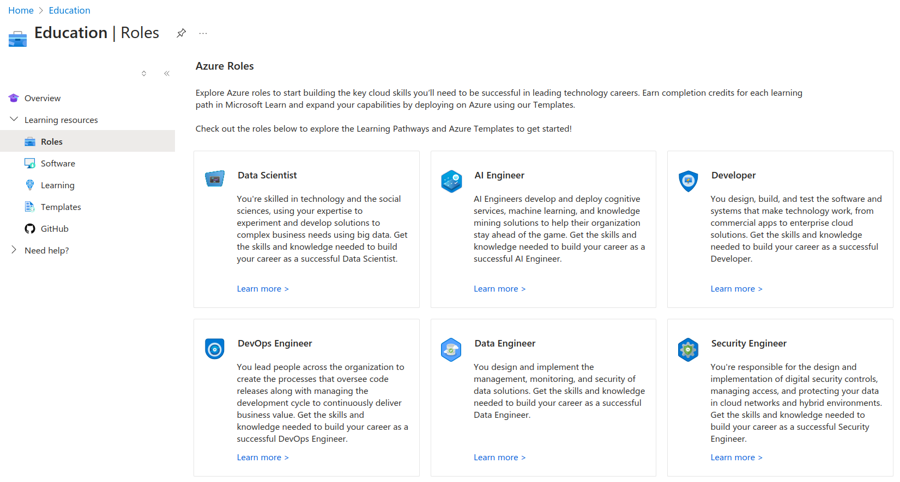
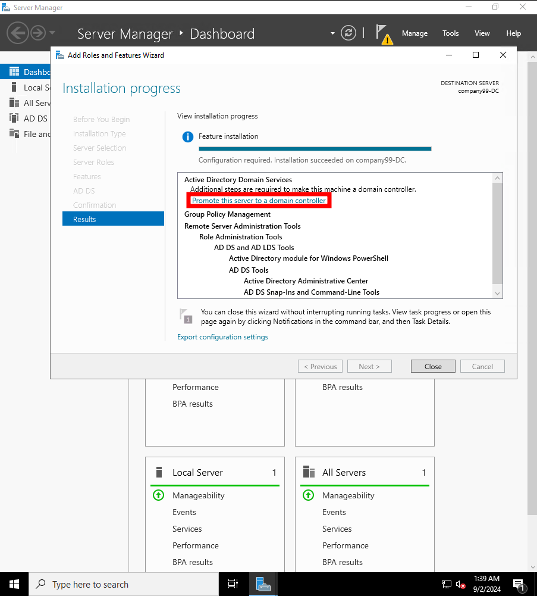
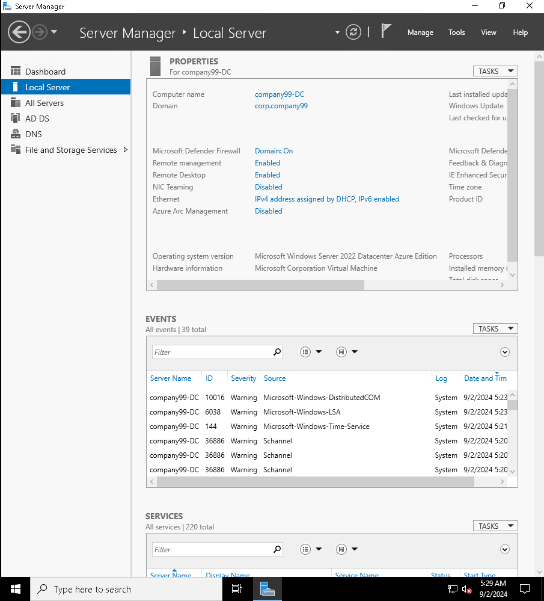

# Azure Lab
## Summary
Getting familiar with Microsoft's more popular products, focusing on Azure and Active Directory.

## Free trial and student benefits
Azure offers $100 of credit for students, which expires a year from signing up, and I plan to make the most of this. Much appreciated, Microsoft! [https://azure.microsoft.com/en-us/free/students/](https://azure.microsoft.com/en-us/free/students/)

I also noticed several "Roles" that include structured lessons and practice for specific careers; the DevOps and Security Engineer roles definitely caught my attention, but I'll leave them for another time.


## Creating a domain controller
Heading to `Virtual machines`, I went through the steps to create a Windows virtual machine for my Domain Controller.
- Name: company99-DC (this will be the fictional name for the company that I'm configuring AD for)
- Resource group: company99
- "Run with Azure Spot discount"
  - This provides a greatly discounted rate for only using extra capacity when Azure's servers have it available. Probably not good for a domain controller under normal circumstances, but this will help me stretch my free credits.
- Standard_D2s_v3 - 2vcpus, 8GiB memory ($0.02632/hour)
- Allow inbound traffic on port 3389 for RDP
- Defaults for storage and network
- Set an automatic daily shutdown time (to not waste money and resources)

## Promoting server to domain controller
After a moment of waiting for deployment, the machine was available. I was able to connect via RDP (using Remmina, since I'm on Linux) and authenticate with the admin account I created during provisioning. 

First, for the sake of not having RDP available on the public internet, I'll modify the Network Settings to only allow RDP from my IP address, rather than any. Because of DHCP on my home network, I'll likely need to reset the accessible IP to my new IP each time I sit down to work on this, but I'm alright with this for now.

I'll also apply any pending Windows updates on the server before proceeding.

Opening `Server Manager > Manage > Add Roles and Features`, I'll use "Role-based of feature-based installation" to select `Active Directory Domain Services`, and then proceed with the defaults.

After it's done installing the required features, I'll click the link/button to "Promote this server to a domain controller."



Next the wizard will walk through another series of steps:

- Add a new forest: `corp.company99`
- Accept default DC options and create a secure password for Directory Services Restore Mode (DSRM).
- Notice that on `Review Options` it offers a Powershell script to automate additional installations... which I'll gladly save for later because it sounds interesting:

```
#
# Windows PowerShell script for AD DS Deployment
#

Import-Module ADDSDeployment
Install-ADDSForest `
-CreateDnsDelegation:$false `
-DatabasePath "C:\Windows\NTDS" `
-DomainMode "WinThreshold" `
-DomainName "corp.company99" `
-DomainNetbiosName "CORP" `
-ForestMode "WinThreshold" `
-InstallDns:$true `
-LogPath "C:\Windows\NTDS" `
-NoRebootOnCompletion:$false `
-SysvolPath "C:\Windows\SYSVOL" `
-Force:$true
```

- Continue configuration and select `Install`.
- Wait for server to restart and then reconnect to verify the changes were applied


## Creating users and workstations
At this point I'll create a few users and workstations to test the domain controller's functionality.

- Open `Active Directory Users and Computers` and create the following:
  - `Groups`:
    - `Developers` (for our software engineering department... which is the only department for now)
  - `Users`:
    - `Alice`
    - `Bob`
  - `Workstations`:
    - `ws01`
    - `ws02`

In creating initial, intentionally weak passwords for my users, I was blocked by the default password policy. Although I could have disabled this, I decided to take the opportunity to create an even stronger password policy for the domain.
`Group Policy Management > Forest: corp.company99 > Domains > corp.company99 > Default Domain Policy > Edit`
`Computer Configuration > Policies > Windows Settings > Security Settings > Account Policies > Password Policy`
I'll remove the maximum age requirement in favor of longer passwords/passphrases; I feel that this is more secure than mandating regular password changes, which can result in users creating weaker passwords and storing them in less secure ways.
- Undefine `Maximum password age` 
- Define `Relax minimum password length` and set to enabled to allow for passwords longer than 14 characters
- Set `Minimum password length` to 16 characters

## Ideas for next steps:
- Implement a password filter to prevent users from using common passwords (wordlists) or passwords that include their username
https://learn.microsoft.com/en-us/previous-versions/windows/it-pro/windows-server-2008-R2-and-2008/hh994562(v=ws.10)?redirectedfrom=MSDN

  - Implement a password filter to prevent users from using passwords that have been exposed in data breaches
  - Install some default software on the workstations through Group Policy
  - Create a shared folder for the Developers group to collaborate on projects
  - Create a backup solution for the domain controller
  - Domain controller redundancy
  - Implement a VPN for remote access to the domain

